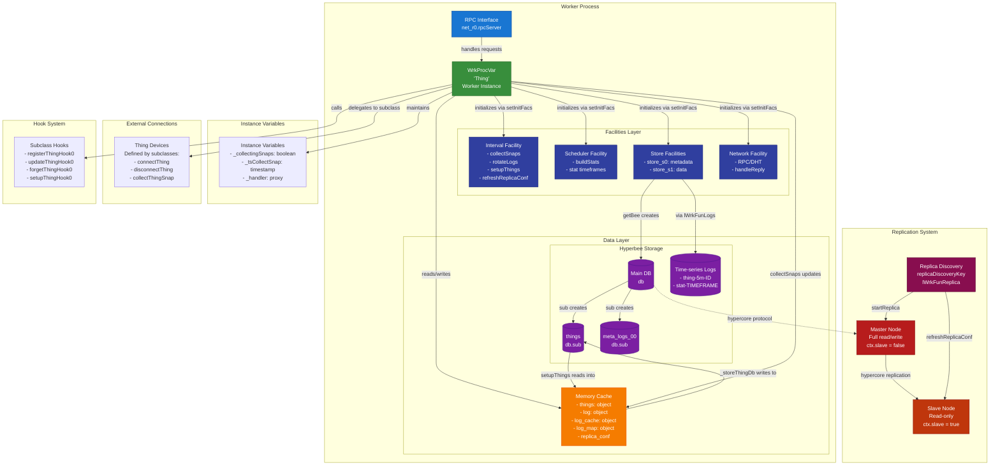

# miningos-tpl-wrk-thing

## Table of Contents

1. [Overview](#overview)
2. [Architecture](#architecture)
    1. [Detailed Component Architecture](#detailed-component-architecture)
    2. [Object Model](#object-model)
    3. [Worker Types](#worker-types)
3. [Core Concepts](#core-concepts)
    1. [Thing](#thing)
    2. [Tag System](#tag-system)
    3. [Snapshot](#snapshot)
4. [API Reference](#api-reference)
    1. [Thing Management](#thing-management)
    2. [Thing Operation](#thing-operation)
    3. [Data Access](#data-access)
       
## Overview

The WrkProcVar class provides a comprehensive base implementation for managing abstract entities (“things”) in MiningOS. Originally designed for physical device management, the framework has proven flexible enough to handle various data sources and services critical to mining operations.

## Architecture

### Detailed Component Architecture:



This comprehensive view reveals the complete system architecture including internal components and external integrations. The Facilities Layer provides pluggable services that workers initialize during startup via setInitFacs, including interval-based tasks (snapshot collection, log rotation, thing setup, and replica configuration refresh), scheduled statistics generation, network services with RPC/DHT capabilities, and distributed storage management. The dual-storage architecture separates volatile in-memory caches (containing things, logs, and replica configuration) from persistent Hyperbee databases, with time-series logs stored separately for efficient historical data access. External connections are defined through abstract methods that subclasses must implement for specific device types. The replication system leverages Hypercore's peer-to-peer protocol with replica discovery, enabling automatic master-slave synchronization where masters have full read/write capabilities while slaves operate in read-only mode. The Hook System provides extension points for subclasses to customize thing lifecycle operations.

### Object Model

The following is a fragment of [MiningOS object model](https://docs.mos.tether.io/) that contains the abstract class representing "thing" (highlighted in blue). The rounded nodes reprsent abstract classes and the one square node represents a concrete class:

```mermaid
---
title: Object Model of MiningOS
---
flowchart BT
    bfx-wrk-base@{ shape: stadium, label: "*bfx-wrk-base*" }

    tether-wrk-base@{ shape: stadium, label: "*tether-wrk-base*" }
    tether-wrk-base--->bfx-wrk-base

    miningos-tlp-wrk-thing@{ shape: stadium, label: "*miningos-tlp-wrk-thing*" }
    miningos-tlp-wrk-thing--->tether-wrk-base


    miningos-tlp-wrk-electricity@{ shape: stadium, label: "*miningos-tlp-wrk-electricity*" }
    miningos-tlp-wrk-electricity--->miningos-tlp-wrk-thing

    miningos-tlp-wrk-switchgear@{ shape: stadium, label: "*miningos-tlp-wrk-switchgear*" }
    miningos-tlp-wrk-switchgear--->miningos-tlp-wrk-thing

    miningos-tlp-wrk-miner@{ shape: stadium, label: "*miningos-tlp-wrk-miner*" }
    miningos-tlp-wrk-miner--->miningos-tlp-wrk-thing

    miningos-tlp-wrk-container@{ shape: stadium, label: "*miningos-tlp-wrk-container*" }
    miningos-tlp-wrk-container--->miningos-tlp-wrk-thing

    miningos-tlp-wrk-powermeter@{ shape: stadium, label: "*miningos-tlp-wrk-powermeter*" }
    miningos-tlp-wrk-powermeter--->miningos-tlp-wrk-thing

    miningos-tlp-wrk-sensor@{ shape: stadium, label: "*miningos-tlp-wrk-sensor*" }
    miningos-tlp-wrk-sensor--->miningos-tlp-wrk-thing

    miningos-tlp-wrk-minerpool@{ shape: stadium, label: "*miningos-tlp-wrk-minerpool*" }
    miningos-tlp-wrk-minerpool--->miningos-tlp-wrk-thing

    miningos-wrk-ext-mempool["miningos-wrk-ext-mempool"]
    miningos-wrk-ext-mempool--->miningos-tlp-wrk-thing

    style miningos-tlp-wrk-thing fill:#005,stroke-width:4px
```



### Worker Types
The system implements a sophisticated multi-level inheritance hierarchy:

#### Inheritance Levels
```
Level 1: bfx-wrk-base (Foundation)
    ↓
Level 2: tether-wrk-base (Foundation)
    ↓
Level 3: miningos-tlp-wrk-thing/WrkProcVar (Thing Management Base)
    ↓
Level 4: Device Category Templates
    ↓
Level 5: Brand/Model Specific Implementations
```

#### Implementation Pattern
Each level provides increasing specialization:
- **Level 1**: Provides worker infrastructure (lifecycle, facilities, configuration)
- **Level 2**: Provides worker infrastructure (lifecycle, facilities, configuration)
- **Level 3**: Defines abstract methods like `connectThing()`, `collectThingSnap()`
- **Level 4**: May provide default implementations or remain abstract
- **Level 5**: Implements device-specific logic

MiningOS implements a hierarchical class structure for different worker types:

#### Level 1: Foundation
- **bfx-wrk-base**: Core worker functionality (configuration, facilities, lifecycle)

#### Level 2: Foundation 
- **tether-wrk-base**: Core worker functionality (configuration, facilities, lifecycle)

#### Level 3: Thing Management Base
- **miningos-tlp-wrk-thing (WrkProcVar)**: Abstract base implementing:
  - Thing CRUD operations
  - RPC interface
  - Storage management
  - Replication logic
  - Abstract methods for device interaction

#### Level 4: Device Category Templates
These templates extend the base thing class for specific device categories, providing:
- Default implementations for common operations
- Category-specific facilities
- Shared business logic

Available templates:
- **miningos-tlp-wrk-container**: Container/rack infrastructure
- **miningos-tlp-wrk-miner**: Mining hardware management
- **miningos-tlp-wrk-powermeter**: Power monitoring equipment
- **miningos-tlp-wrk-sensor**: Environmental and operational sensors
- **miningos-tlp-wrk-switchgear**: Switchgear equipment

This architecture allows maximum code reuse while supporting diverse hardware with minimal implementation effort.

## Core Concepts

### Things

A "thing" represents any manageable entity in MiningOS. While originally designed for physical devices, the concept has evolved to include any resource that requires monitoring, management, or data collection.

### Snapshots

Periodic data collection from devices:

- Device metrics --- hashrate, temperature, power according to each device type;
- Operational status --- offline status is flagged by Thing class;
- Errors (timeouts, connection failures, device errors);

## API Reference

### Thing Management

#### Register Thing
```javascript
registerThing(req)
```
Creates a new device in the system.

**Parameters:**
- `req.id`: Device ID (auto-generated if not provided)
- `req.code`: Device code (auto-generated if not provided)
- `req.opts`: Device options (**necessary** for connecting to device)
- `req.info`: Device metadata (defaults to `{}` if not provided)
- `req.tags`: Additional tags (auto-generated if not provided)
- `req.comment`: Registration comment (optional)
- `req.user`: User making the request (only used with comment)

**Returns:** `1` on success

**Errors:**
- `ERR_SLAVE_BLOCK`: Operation blocked on slave nodes
- `ERR_THING_WITH_ID_ALREADY_EXISTS`: Duplicate ID
- `ERR_THING_WITH_CODE_ALREADY_EXISTS`: Duplicate code
- `ERR_THING_CODE_INVALID`: Malformed string for code

#### Update Thing
```javascript
updateThing(req)
```
Updates an existing device.

**Parameters:**
- `req.id` (the only required): Device ID
- `req.opts`: Updated options
- `req.info`: Updated metadata
- `req.tags`: Updated tags
- `req.forceOverwrite`: (boolean) Replace instead of merge (with *spread operator*)
- `req.comment`: Update comment
- `req.user`: User making the request
- `req.actionId`: Action identifier for tracking

**Returns:** `1` on success

**Errors:**
- `ERR_THING_NOTFOUND`: Device not found
- `ERR_SLAVE_BLOCK`: Operation blocked on slave nodes

#### List Things
```javascript
listThings(req)
```
Query devices with filters and pagination.

**Parameters:** (all optional)
- `req.query`: MongoDB-style query
- `req.fields`: Field projection
- `req.sort`: Sort criteria. None = maintains natural order
- `req.offset`: Skip records (default: 0)
- `req.limit`: Max records (default: 100)
- `req.status`: Include status information

**Returns:** Array of device objects

**Errors:**
- Implicitly through invalid MongoDB querries.

#### Forget Things
```javascript
forgetThings(req)
```
Remove devices from the system.

**Parameters:**
- `req.query`: Query to select devices
- `req.all`: (boolean) True means *'Remove all devices'*

**Returns:** Number of devices removed

**Errors:**
- `ERR_SLAVE_BLOCK`: Operation blocked on slave nodes
- Implicitly through invalid MongoDB querries.

### Data Access

#### Tail Log
```javascript
tailLog(req)
```
Retrieve time-series log data.

**Parameters:**
- `req.key`: Log type identifier
- `req.tag`: Device tag
- `req.offset`: Log file offset
- `req.limit`: Max entries
- `req.start`: Start timestamp
- `req.end`: End timestamp
- `req.fields`: Field projection

**Returns:** Array of log entries

#### Get Historical Logs
```javascript
getHistoricalLogs(req)
```
Retrieve historical alerts or info changes.

**Parameters:**
- `req.logType`: 'alerts' or 'info'
- `req.offset`: Starting offset
- `req.limit`: Max entries
- `req.start`: Start timestamp
- `req.end`: End timestamp

**Returns:** Array of historical entries

### Thing Operations

#### Query Thing
```javascript
queryThing(req)
```
Execute a method on a specific device.

**Parameters:**
- `req.id`: Device ID
- `req.method`: Method name
- `req.params`: Method parameters

**Returns:** Method execution result

**Errors:**
- `ERR_THING_NOTFOUND`: Device not found
- `ERR_THING_NOT_INITIALIZED`: Device controller not ready
- `ERR_THING_METHOD_NOTFOUND`: Method doesn't exist

#### Apply Things
```javascript
applyThings(req)
```
Execute bulk operations on multiple devices.

**Parameters:**
- `req.method` (required): Method to execute
- `req.query`: MongoDB-style query to select devices (default: all devices)
- `req.params`: Array of parameters to pass to the method (default: empty)
- `req.fields`: Field projection for device selection
- `req.sort`: Sort criteria for device selection
- `req.offset`: Number of devices to skip
- `req.limit`: Maximum number of devices to process

**Returns:** Number of successful operations
