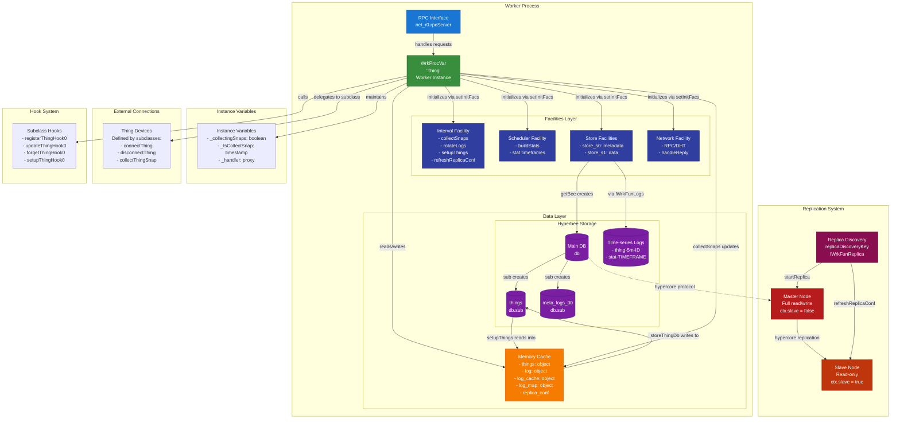

# miningos-tpl-wrk-thing

## Table of Contents

1. [Overview](#overview)
2. [Architecture](#architecture)
    1. [Detailed Component Architecture](#detailed-component-architecture)
    2. [Object Model](#object-model)
    3. [Worker Types](#worker-types)
3. [Core Concepts](#core-concepts)
    1. [Thing](#thing)
    2. [Tag System](#tag-system)
    3. [Snapshot](#snapshot)
4. [API Reference](#api-reference)
       
## Overview

The WrkProcVar class provides a comprehensive base implementation for managing abstract entities (“things”) in MiningOS. Originally designed for physical device management, the framework has proven flexible enough to handle various data sources and services critical to mining operations.

## Architecture

### Detailed Component Architecture:


```mermaid
graph TB
    subgraph "Worker Process"
        RPC[RPC Interface<br/>net_r0.rpcServer]
        Worker[WrkProcVar<br/>'Thing'<br/>Worker Instance]
        
        subgraph "Facilities Layer"
            Interval[Interval Facility<br/>- collectSnaps<br/>- rotateLogs<br/>- setupThings<br/>- refreshReplicaConf]
            Scheduler[Scheduler Facility<br/>- buildStats<br/>- stat timeframes]
            Store[Store Facilities<br/>- store_s0: metadata<br/>- store_s1: data]
            Net[Network Facility<br/>- RPC/DHT<br/>- handleReply]
        end
        
        subgraph "Data Layer"
            Memory[Memory Cache<br/>- things: object<br/>- log: object<br/>- log_cache: object<br/>- log_map: object<br/>- replica_conf]
            
            subgraph "Hyperbee Storage"
                MainDB[(Main DB<br/>db)]
                Things[(things<br/>db.sub)]
                MetaLogs[(meta_logs_00<br/>db.sub)]
                TimeLogs[(Time-series Logs<br/>- thing-5m-ID<br/>- stat-TIMEFRAME)]
            end
        end
        
        RPC -->|handles requests| Worker
        Worker -->|initializes via setInitFacs| Interval
        Worker -->|initializes via setInitFacs| Scheduler
        Worker -->|initializes via setInitFacs| Store
        Worker -->|initializes via setInitFacs| Net
        
        Worker -->|reads/writes| Memory
        Store -->|getBee creates| MainDB
        MainDB -->|sub creates| Things
        MainDB -->|sub creates| MetaLogs
        Store -->|via lWrkFunLogs| TimeLogs
        
        Things -->|setupThings reads into| Memory
        Worker -->|collectSnaps updates| Memory
        Memory -->|_storeThingDb writes to| Things
    end
    
    subgraph "Instance Variables"
        InstVars[Instance Variables<br/>- _collectingSnaps: boolean<br/>- _tsCollectSnap: timestamp<br/>- _handler: proxy]
        Worker -->|maintains| InstVars
    end
    
    subgraph "External Connections"
        Devices[Thing Devices<br/>Defined by subclasses:<br/>- connectThing<br/>- disconnectThing<br/>- collectThingSnap]
        
        Worker -->|delegates to subclass| Devices
    end
    
    subgraph "Replication System"
        Master[Master Node<br/>Full read/write<br/>ctx.slave = false]
        Slave[Slave Node<br/>Read-only<br/>ctx.slave = true]
        Discovery[Replica Discovery<br/>replicaDiscoveryKey<br/>lWrkFunReplica]
        
        Master -->|hypercore replication| Slave
        Discovery -->|startReplica| Master
        Discovery -->|refreshReplicaConf| Slave
        MainDB -.->|hypercore protocol| Master
    end
    
    subgraph "Hook System"
        Hooks[Subclass Hooks<br/>- registerThingHook0<br/>- updateThingHook0<br/>- forgetThingHook0<br/>- setupThingHook0]
        Worker -->|calls| Hooks
    end
    
    style RPC fill:#1976d2,stroke:#0d47a1,color:#fff
    style Worker fill:#388e3c,stroke:#1b5e20,color:#fff
    style Memory fill:#f57c00,stroke:#e65100,color:#fff
    style MainDB fill:#7b1fa2,stroke:#4a148c,color:#fff
    style Things fill:#7b1fa2,stroke:#4a148c,color:#fff
    style MetaLogs fill:#7b1fa2,stroke:#4a148c,color:#fff
    style TimeLogs fill:#7b1fa2,stroke:#4a148c,color:#fff
    style Interval fill:#303f9f,stroke:#1a237e,color:#fff
    style Scheduler fill:#303f9f,stroke:#1a237e,color:#fff
    style Store fill:#303f9f,stroke:#1a237e,color:#fff
    style Net fill:#303f9f,stroke:#1a237e,color:#fff
    style Master fill:#b71c1c,stroke:#7f0000,color:#fff
    style Slave fill:#bf360c,stroke:#870000,color:#fff
    style Discovery fill:#880e4f,stroke:#560027,color:#fff
```

This comprehensive view reveals the complete system architecture including internal components and external integrations. The Facilities Layer provides pluggable services that workers initialize during startup via setInitFacs, including interval-based tasks (snapshot collection, log rotation, thing setup, and replica configuration refresh), scheduled statistics generation, network services with RPC/DHT capabilities, and distributed storage management. The dual-storage architecture separates volatile in-memory caches (containing things, logs, and replica configuration) from persistent Hyperbee databases, with time-series logs stored separately for efficient historical data access. External connections are defined through abstract methods that subclasses must implement for specific device types. The replication system leverages Hypercore's peer-to-peer protocol with replica discovery, enabling automatic master-slave synchronization where masters have full read/write capabilities while slaves operate in read-only mode. The Hook System provides extension points for subclasses to customize thing lifecycle operations.

### Object Model

The following is a fragment of [MiningOS object model](https://docs.mos.tether.io/) that contains the abstract class representing "thing" (highlighted in blue). The rounded nodes reprsent abstract classes and the one square node represents a concrete class:


```mermaid
---
title: Object Model of MiningOS
---
flowchart BT
    bfx-wrk-base@{ shape: stadium, label: "*bfx-wrk-base*" }

    tether-wrk-base@{ shape: stadium, label: "*tether-wrk-base*" }
    tether-wrk-base--->bfx-wrk-base

    miningos-tlp-wrk-thing@{ shape: stadium, label: "*miningos-tlp-wrk-thing*" }
    miningos-tlp-wrk-thing--->tether-wrk-base


    miningos-tlp-wrk-electricity@{ shape: stadium, label: "*miningos-tlp-wrk-electricity*" }
    miningos-tlp-wrk-electricity--->miningos-tlp-wrk-thing

    miningos-tlp-wrk-switchgear@{ shape: stadium, label: "*miningos-tlp-wrk-switchgear*" }
    miningos-tlp-wrk-switchgear--->miningos-tlp-wrk-thing

    miningos-tlp-wrk-miner@{ shape: stadium, label: "*miningos-tlp-wrk-miner*" }
    miningos-tlp-wrk-miner--->miningos-tlp-wrk-thing

    miningos-tlp-wrk-container@{ shape: stadium, label: "*miningos-tlp-wrk-container*" }
    miningos-tlp-wrk-container--->miningos-tlp-wrk-thing

    miningos-tlp-wrk-powermeter@{ shape: stadium, label: "*miningos-tlp-wrk-powermeter*" }
    miningos-tlp-wrk-powermeter--->miningos-tlp-wrk-thing

    miningos-tlp-wrk-sensor@{ shape: stadium, label: "*miningos-tlp-wrk-sensor*" }
    miningos-tlp-wrk-sensor--->miningos-tlp-wrk-thing

    miningos-tlp-wrk-minerpool@{ shape: stadium, label: "*miningos-tlp-wrk-minerpool*" }
    miningos-tlp-wrk-minerpool--->miningos-tlp-wrk-thing

    miningos-wrk-ext-mempool["miningos-wrk-ext-mempool"]
    miningos-wrk-ext-mempool--->miningos-tlp-wrk-thing

    style miningos-tlp-wrk-thing fill:#005,stroke-width:4px
```

### Worker Types
The system implements a sophisticated multi-level inheritance hierarchy:

#### Inheritance Levels
```
Level 1: bfx-wrk-base (Foundation)
    ↓
Level 2: tether-wrk-base (Foundation)
    ↓
Level 3: miningos-tlp-wrk-thing/WrkProcVar (Thing Management Base)
    ↓
Level 4: Device Category Templates
    ↓
Level 5: Brand/Model Specific Implementations
```

#### Implementation Pattern
Each level provides increasing specialization:
- **Level 1**: Provides worker infrastructure (lifecycle, facilities, configuration)
- **Level 2**: Provides worker infrastructure (lifecycle, facilities, configuration)
- **Level 3**: Defines abstract methods like `connectThing()`, `collectThingSnap()`
- **Level 4**: May provide default implementations or remain abstract
- **Level 5**: Implements device-specific logic

MiningOS implements a hierarchical class structure for different worker types:

#### Level 1: Foundation
- **bfx-wrk-base**: Core worker functionality (configuration, facilities, lifecycle)

#### Level 2: Foundation 
- **tether-wrk-base**: Core worker functionality (configuration, facilities, lifecycle)

#### Level 3: Thing Management Base
- **miningos-tlp-wrk-thing (WrkProcVar)**: Abstract base implementing:
  - Thing CRUD operations
  - RPC interface
  - Storage management
  - Replication logic
  - Abstract methods for device interaction

#### Level 4: Device Category Templates
These templates extend the base thing class for specific device categories, providing:
- Default implementations for common operations
- Category-specific facilities
- Shared business logic

Available templates:
- **miningos-tlp-wrk-container**: Container/rack infrastructure
- **miningos-tlp-wrk-miner**: Mining hardware management
- **miningos-tlp-wrk-powermeter**: Power monitoring equipment
- **miningos-tlp-wrk-sensor**: Environmental and operational sensors
- **miningos-tlp-wrk-switchgear**: Switchgear equipment

This architecture allows maximum code reuse while supporting diverse hardware with minimal implementation effort.

## Core Concepts

### Things

A "thing" represents any manageable entity in MiningOS. While originally designed for physical devices, the concept has evolved to include any resource that requires monitoring, management, or data collection.

### Snapshots

Periodic data collection from devices:

- Device metrics --- hashrate, temperature, power according to each device type;
- Operational status --- offline status is flagged by Thing class;
- Errors (timeouts, connection failures, device errors);

## API Reference

The API is documented via [`docs/openrpc.json`](docs/openrpc.json), generated from JSDoc annotations. Add `@typedef` in [`workers/lib/types.js`](workers/lib/types.js) for types and annotate methods in [`workers/rack.thing.wrk.js`](workers/rack.thing.wrk.js) with `@param`, `@returns`, and `@throws`. Then run:

```bash
npm run openrpc:generate && npm run openrpc:validate
```

The JSON spec can be consumed by documentation systems to produce user-facing API docs. See [`docs/readme.md`](docs/readme.md) for details.
